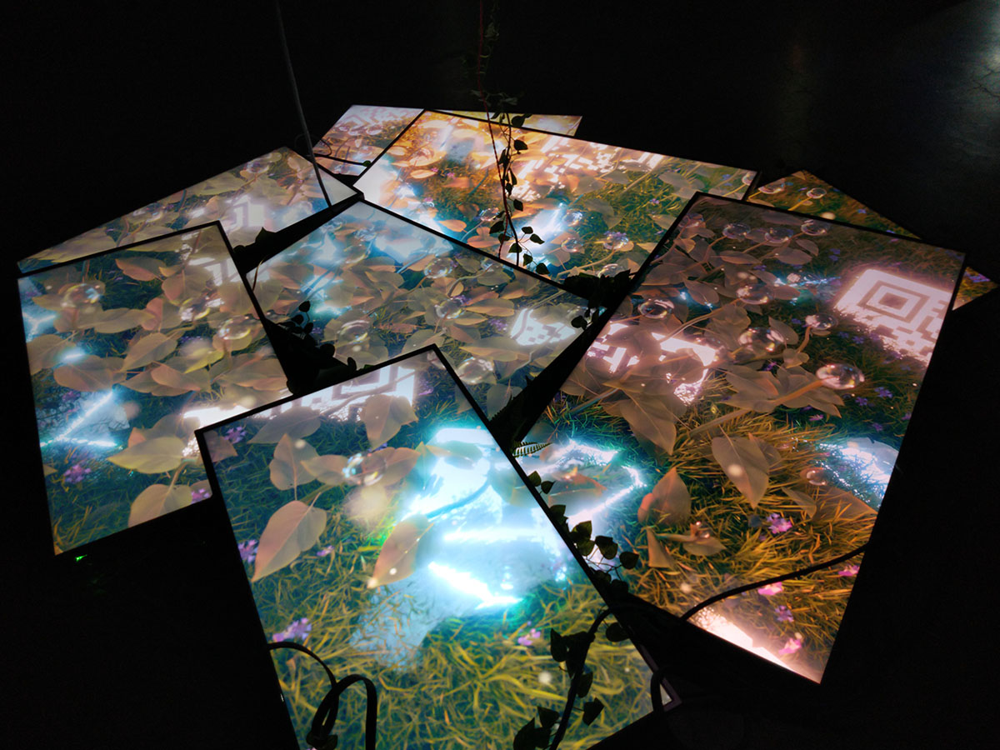
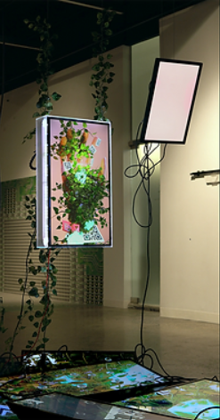
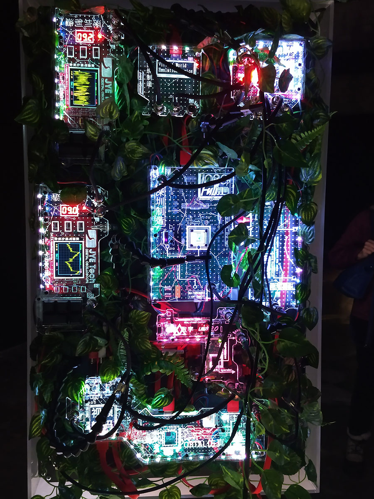

# 6e Biennale internationale d'art numérique BIAN 6 - METAMORPHOSIS - MUTATION

crédit photo: https://elektramontreal.ca

### Lieu et type d'exposition
La BIAN avait lieu à la galerie Arnesal Art Contemporain, à Montréal. Il s'agit d'un événement temporaire diffusé par l'organisme Elektra, qui était présenté du 1er décembre 2022 au 5 février 2023. J'ai visité cette exposition le 3 février dernier.

# Nature Morte 7 (2022)

Par Baron Lanteigne 

crédit photo: https://elektramontreal.ca

### Description de l'oeuvre
Nature Morte 7 présente une fenêtre – unique mais fragmentée – composée de plusieurs écrans. La pièce centrale de cette œuvre combine un écran avec divers composantes électroniques qui s’illuminent. Cette sculpture suspendue tourne le dos au spectateur, afin de mettre en évidence son fonctionnement interne. Les composantes électroniques « grand public » dont l'œuvre est composée sont délibérément sortis de leur contexte habituel afin de révéler leur potentiel, qui est souvent banalisé (https://www.elektramontreal.ca/bian2022-baron-lanteigne?lang=fr). 

L’œuvre fait appel au contenant autant qu'au contenu ; les composantes électroniques sont aussi apparentes que ce qui est affiché à l'écran. Toutes les deux invitent à la réflexion en liant nos deux réalités vécues, physique et virtuelle. Le réseau modulaire que l'on voit à l'arrière de la sculpture crée une lueur qui prolonge le monde virtuel au-delà de l'écran. L'œuvre agrandit et exagère également l'espace que prend une telle technologie, afin de souligner son omniprésence (https://www.elektramontreal.ca/bian2022-baron-lanteigne?lang=fr).

### Type d'installation et mise en espace
Il s'agit d'une oeuvre contemplative qui était installée en plein milieu d'une pièce ouverte, non loin d'une autre oeuvre volumineuse. Plusieurs écrans étaient empilés au sol formant presque un cercle, et deux autres écrans étaient suspendus du plafond juste au-dessus. L'écran principal fait dos au spectateur. 

  https://www.elektramontreal.ca/bian2022-baron-lanteigne?lang=fr 

### Composantes et techniques
- 10 écrans
- Fils pour brancher les écrans
- Câbles pour suspendre les écrans
- Vidéo d'animation 3D réaliste
- Vignes de feuilles artificielles
- Composantes électroniques
- Éclairage coloré

### Éléments nécessaires à la mise en exposition
Je n'ai pas été en mesure de trouver l'information à savoir si les nombreux fils et les câbles pour suspendre les écrans sont fournis par l'artiste ou par la salle d'exposition. Comme ils sont décorés de fausses feuilles qui semblent faire partie de l'oeuvre, ces éléments pourraient appartenir à l'artiste. 

 https://baronlanteigne.com/naturemorte7.html

### Expérience vécue
Quand le visiteur se dirige vers l'oeuvre, il constate d'abord que l'écran qui est à sa hauteur lui fait dos, ce qui l'incite à faire le tour complet de l'oeuvre pour la voir en entier. Il regarde par terre pour observer l'animation diffusée sur les écrans déposés au sol, et regarde de plus près les circuits électroniques qui se trouvent derrière l'écran principal.

### Ce qui m'a plu
Cette oeuvre a retenu mon attention parce qu'elle semblait à l'envers et désordonnée. Cela m'a rendue curieuse et m'a poussée à aller observer de plus près et lire la description pour comprendre le contexte. Les couleurs et les lumières, ainsi que l'ambiance douce de l'animation donnent une sensation de joie et de sérénité. Puis, la signification que l'artiste donne à l'oeuvre amène une toute autre perspective à l'interprétation que j'en fais. Avec mon expérience de travail en intervention, de même que par ma qualité de mère, je suis depuis un certain temps très interpellée par la réalité du travail invisible. À la fin de ma première session en intégration multimédia, j'ai fait le parallèle avec toute l'expertise qui se trouve derrière le numérique, l'interactif, dont on ne saisit en général pas l'étendue. Ma vision a été validée avec le principe de potentiel banalisé dont parle la description de l'oeuvre. L'idée de l'omniprésence de la technologie et du virtuel qui empiète sur le réel est aussi venue assombrir et rendre plus complexe ma perception du message de l'oeuvre, ce qui est une bonne chose, car réfléchir à notre avenir est toujours une nécessité. 

### Ce que je ferais autrement
Comme il faisait très sombre malgré la lueur des écrans, et qu'il n'y avait pas de barrière physique autour de l'oeuvre, il était très facile de marcher sur les bords par mégarde. J'ai d'ailleurs pilé sur un fil en m'approchant trop près. Je n'ai pas vu d'affiche indiquant de ne pas toucher comme il y en avait pour d'autres oeuvres. À moins d'avoir une grande confiance en la solidité de son matériel, je pense qu'il serait important d'installer la sculpture d'une façon plus délimitée, de sorte que personne ne puisse l'endommger en marchant dessus. De plus, les fils par terre représentaient un réel risque de trébucher, de se blesser et de faire tout tomber.

### Références
https://elektramontreal.ca
https://baronlanteigne.com/naturemorte7.html
