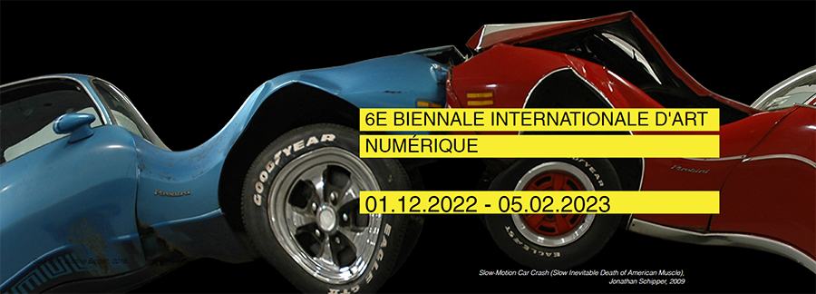
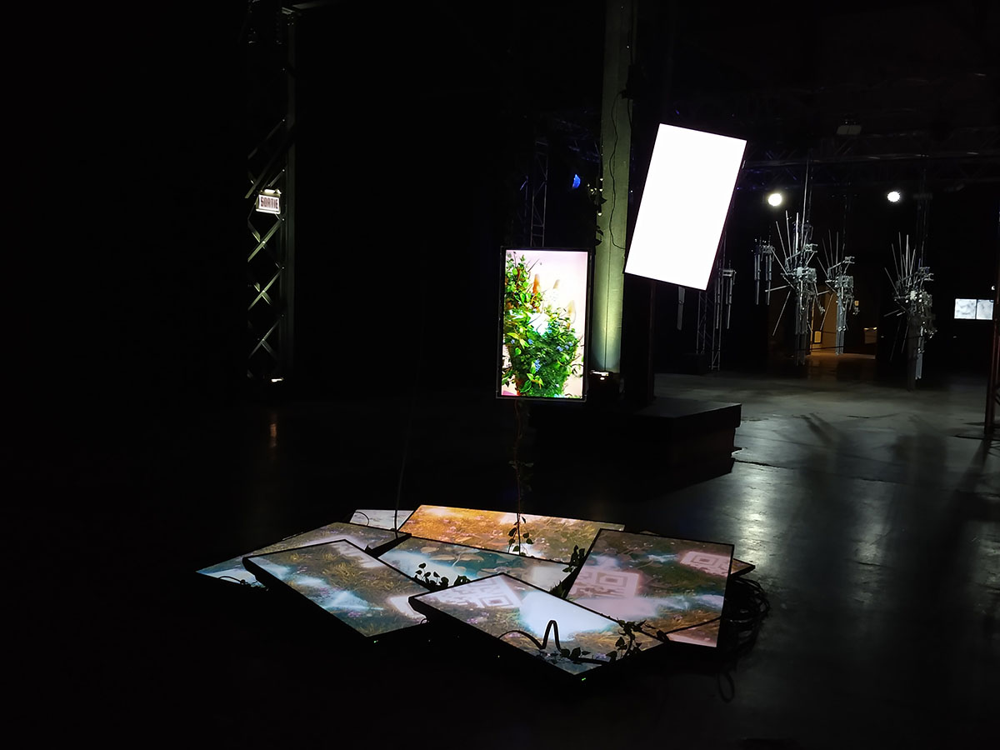
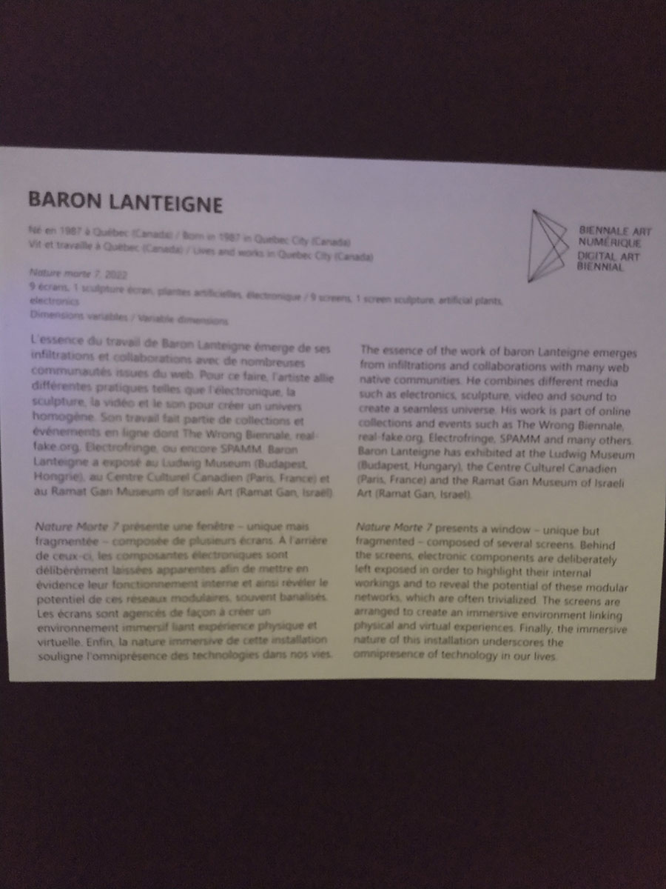
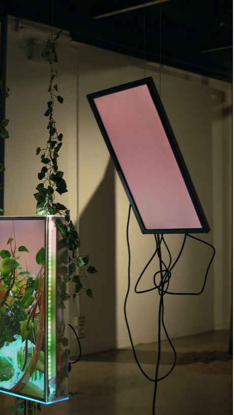

# 6e Biennale internationale d'art numérique BIAN 6 - METAMORPHOSIS - MUTATION

crédit photo: https://elektramontreal.ca

### Lieu et type d'exposition
La BIAN avait lieu à la galerie Arnesal Art Contemporain, à Montréal. Il s'agit d'un événement temporaire qui était présenté du 1er décembre 2022 au 5 février 2023. J'ai visité cette exposition le 3 février dernier.

# Nature Morte 7 (2022)

Par Baron Lanteigne 

crédit photo: https://elektramontreal.ca

### Description de l'oeuvre
Nature Morte 7 présente une fenêtre – unique mais fragmentée – composée de plusieurs écrans. La pièce centrale de cette œuvre combine un écran avec divers composantes électroniques qui s’illuminent. Cette sculpture suspendue tourne le dos au spectateur, afin de mettre en évidence son fonctionnement interne. Les composantes électroniques « grand public » dont l'œuvre est composée sont délibérément sortis de leur contexte habituel afin de révéler leur potentiel, qui est souvent banalisé (https://www.elektramontreal.ca/bian2022-baron-lanteigne?lang=fr). 

L’œuvre fait appel au contenant autant qu'au contenu ; les composantes électroniques sont aussi apparentes que ce qui est affiché à l'écran. Toutes les deux invitent à la réflexion en liant nos deux réalités vécues, physique et virtuelle. Le réseau modulaire que l'on voit à l'arrière de la sculpture crée une lueur qui prolonge le monde virtuel au-delà de l'écran. L'œuvre agrandit et exagère également l'espace que prend une telle technologie, afin de souligner son omniprésence (https://www.elektramontreal.ca/bian2022-baron-lanteigne?lang=fr).

### Type d'installation et mise en espace
Il s'agit d'une oeuvre contemplative qui était installée en plein milieu d'une pièce ouverte, non loin d'une autre oeuvre volumineuse. Plusieurs écrans étaient empilés au sol formant presque un cercle, et deux autres écrans étaient suspendus du plafond juste au-dessus. L'écran principal fait dos au spectateur. 

medias/bian_nature_morte_circuits.jpg

### Composantes et techniques

### Éléments nécessaires à la mise en exposition
Je n'ai pas été en mesure de trouver l'information à savoir si les nombreux fils et les câbles pour suspendre les écrans sont fournis par l'artiste ou par la salle d'exposition. Comme ils sont décorés de fausses feuilles qui semblent faire partie de l'oeuvre, ces éléments pourraient appartenir à l'artiste. 

 https://baronlanteigne.com/naturemorte7.html

### Expérience vécue

### Ce qui m'a plu

### Ce que je ferais autrement
