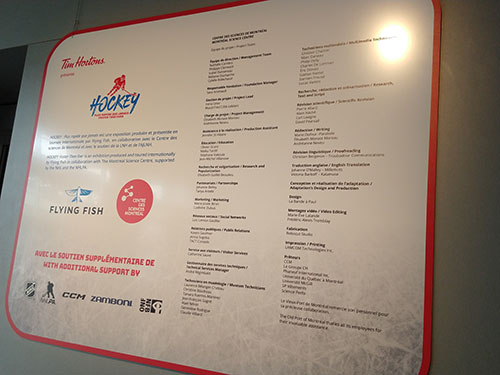
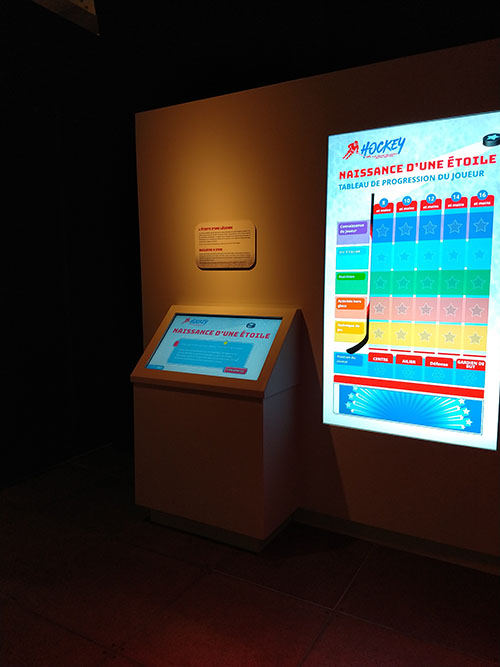
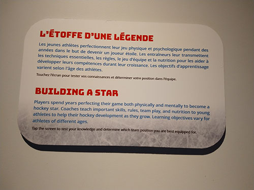
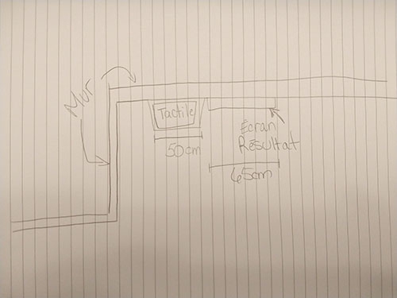
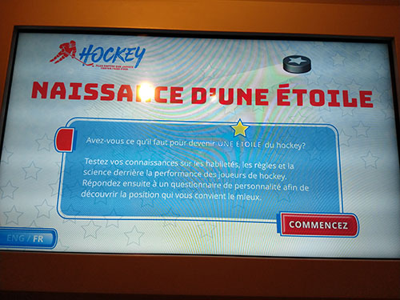
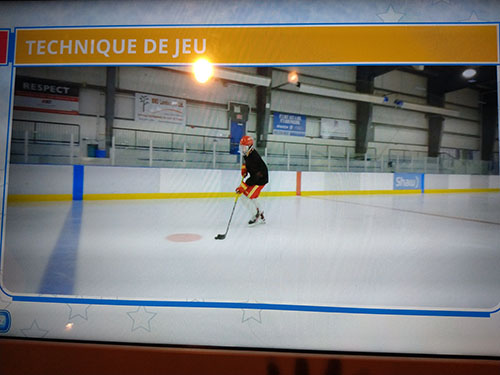
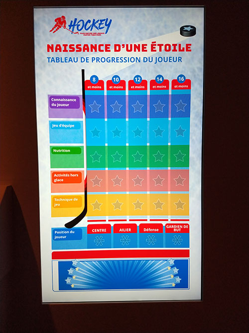

# Hockey: plus rapide que jamais

### Lieu et type d'exposition
Cette exposition internationale temporaire a lieu du 7 avril au 10 septembre 2023, au Centre des Sciences de Montréal. Elle est produite par Flying Fish en collaboration avec le Centre des Sciences, soutenue par la LNH et l'AJLNH, et présentée par Tim Hortons ([Centre des Sciences](https://www.centredessciencesdemontreal.com/exposition-temporaire/hockey-plus-rapide-que-jamais)). Je l'ai visitée le 12 avril dernier.

# Naissance d'une étoile

### Description de l'oeuvre
Consistant en un test de connaissances suivi d'un test de personnalité, ce dispositif invite l'utilisateur à répondre à diverses questions à choix de réponse afin de former un joueur de hockey fictif dont les compétences et la position dans l'équipe varieront en fonction des réponses. 

### Type d'installation
Il s'agit d'une installation interactive de type jeu questionnaire. 

### Fonction du dispositif
Le dispositif multimédia est un support pédagogique puisqu'il permet de diffuser des informations éducatives au sujet de la santé et de la performance des joueurs de hockey.

### Mise en espace

Le dispositif se trouve sur un mur dans la **Zone 4 - Le vestiaire des étoiles montantes** de l'exposition ([Centre des Sciences](https://www.centredessciencesdemontreal.com/exposition-temporaire/hockey-plus-rapide-que-jamais)). À la gauche de l'installation se trouve un autre mur perpendiculaire. L'écran tactile, disposé à 45 degrés dans un présentoir en métal, se trouve à environ un mètre du sol. Juste à sa droite, sur le mur, on retrouve l'écran de résultat. À environ 2 mètres à la droite de l'installation se trouve un autre dispositif au mur. 

### Composantes et techniques
- Écran tactile
- Écran pour l'affichage des résultats 
- Programmation du jeu-questionnaire
- Vidéo-supports pour certaines questions

  

### Éléments nécessaires à la mise en exposition
- Électricité et branchements
- Ordinateur
- Compartiment pour l'écran tactile

### Expérience vécue
Le visiteur est d'abord attiré vers le jeu par la luminosité de l'écran de résulat, qui est le plus grand des deux. En se plaçant devant l'écran tactile, il peut lire l'écriteau explicatif qui se trouve sur le mur à la hauteur des yeux. L'utilisateur lis les questions et regarde les vidéo-supports sur l'écran tactile, puis choisit sa réponse en touchant l'écran à l'endroit approprié. Après chaque réponse, il peut voir sur l'écran de résultat à sa droite l'évolution de son joueur fictif à différents niveaux de performance. 

### Ce qui m'a plu
J'ai aimé le principe d'un jeu éducatif qui incite également à vouloir avoir le meilleur résultat, en plus d'interpeller l'utilisateur avec le test de personnalité permettant de s'identifier à un joueur de hockey. Les différentes dimensions donnent de la substance au produit. Le jeu peut également plaire à une large tranche d'âge et avait une durée respectable permettant de garder le visiteur intéressé pendant assez longtemps.

### Ce que je ferais autrement
La plupart des gens, moi inclue au premier abord, semblait penser que l'écran de résultat était tactile, et même qu'il s'agissait d'un jeu supplémentaire. La disposition était peut-être un peu étrange. La différence de grandeur des écrans contribuait au manque d'unicité et à la confusion du public.

### Références
https://www.centredessciencesdemontreal.com/exposition-temporaire/hockey-plus-rapide-que-jamais
