# Mycélium
 

### Lieu et type d'exposition
Mycélium avait lieu au Collège Montmorency, à Laval, du 20 au 23 mars 2023. C'était un événement temporaire intérieur et extérieur qui présentait les projets de synthèse des finissants de cette année en intégration multimédia. J'ai visité cette exposition le 17 mars, alors qu'elle était en montage.

# LumaSol
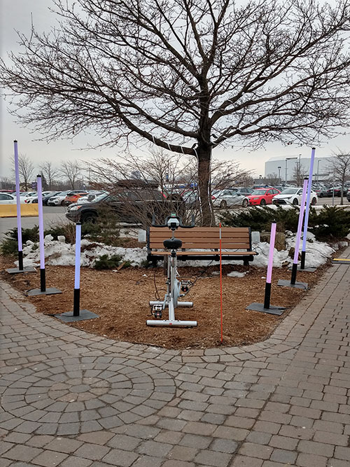

Par Éloïse Gagné, Skayla Stimphil, Michaël Simard et Pénélope Morison

### Description de l'oeuvre
<< Il s'agit d'une expérience multimédia où vous pouvez interagir avec la lumière et un rythme musical à partir d'un vélo stationnaire. Quand quelqu'un monte sur le vélo et pédale, cela illumine les Dels qui entourent l'arbre et celles qui seront suspendues aux bouts de certaines branches sous la forme de feuilles. [...] Toutes ces DEL adressables s'éclairent selon le rythme de l'utilisateur et s'arrêtent automatiquement dès qu'il arrête de pédaler . Les couleurs sont prédéfinies en avance et chaque changement de lumières représente une saison. Cela représente le cycle des saisons. >> ([Site TIM 2023](https://tim-montmorency.com/2023/))

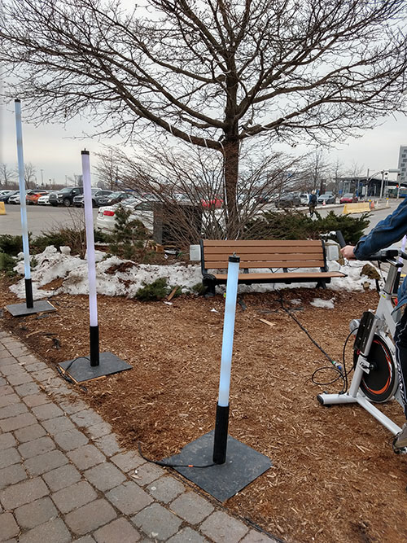 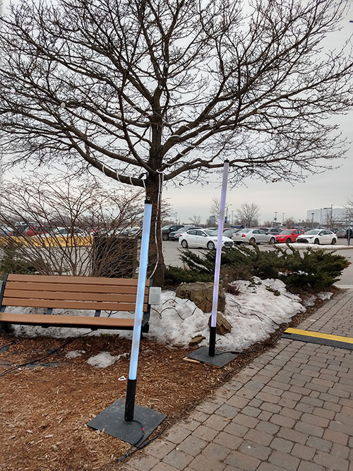 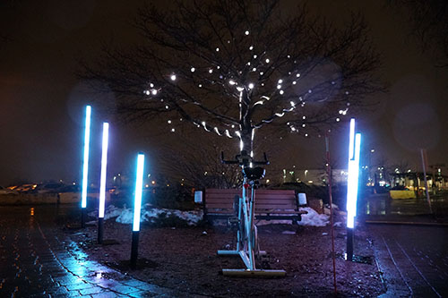 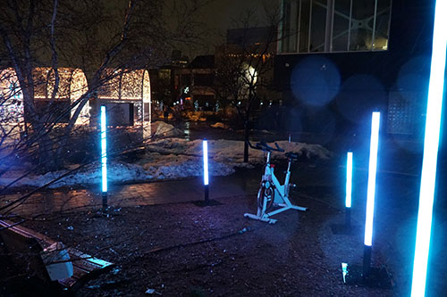

Photos de nuit: [Page LumaSol](https://tim-montmorency.com/2023/projets/LumaSol/docs/web/preproduction.html)

### Type d'installation
Il s'agit d'une oeuvre interactive qui invite l'utilisateur à pédaler pour activer sons et lumières. 

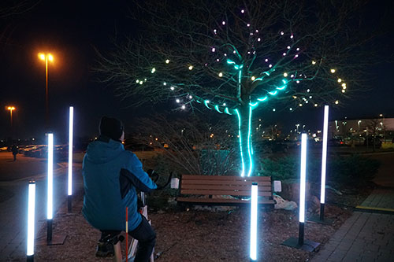 ([Page LumaSol](https://tim-montmorency.com/2023/projets/LumaSol/docs/web/preproduction.html))

### Mise en espace
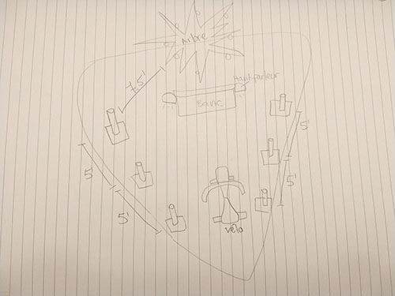

L'installation se trouve à l'extérieur du cégep, sur le bout de terrain triangulaire situé à environ 30 mètres en diagonale gauche de la porte 1, entre deux sentiers de pavé uni. Le vélo stationnaire fait dos au cégep et face à un arbre qui se trouve derrière un banc. Il y a environ 10 mètres entre le vélo et l'arbre. Six tubes lumineux sur pied sont placés de part et d'autre du vélo. Des haut-parleurs dirigés vers le vélo sont accrochés de chaque côté du dossier du banc. Des bandes de lumière LED entourent le tronc de l'arbre et des guirlandes d'ampoules sont installées dans ses branches.

### Composantes et techniques
- Vélo stationnaire

Multimédia
- Bandes sonores
- Fondu de couleurs qui change selon la saison

Lumière
- LED Strip DMX
- DMX Dot String
- Boules lumineuses 200mm
- Tubes opal 1m, 1,5m, 2m

Électricité
- 2 multiprises
- 2 ac current sensor
- 2 moteurs
- 2 microControleurs

Ordinateur
- 1 mac mini

Autre
- 2 détecteurs de rotation des pédales
- 2 Haut-parleurs
- 2 Caissons étanches
- Magrétomètre

([Page LumaSol](https://tim-montmorency.com/2023/projets/LumaSol/docs/web/preproduction.html))

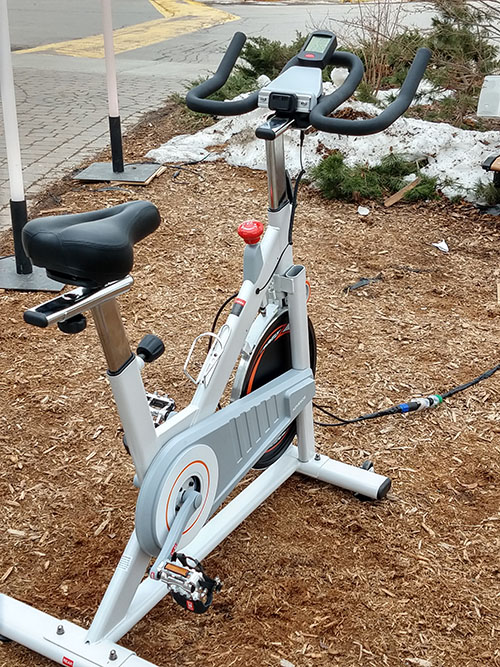 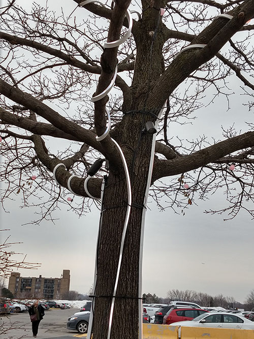 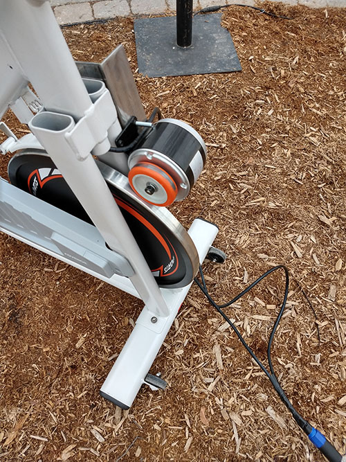 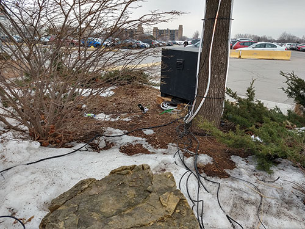 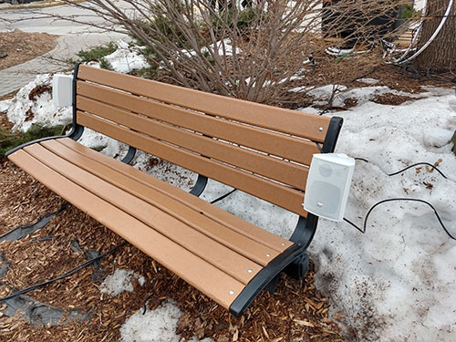

### Éléments nécessaires à la mise en exposition
- Cache-fil pour les sentiers
- Caméras de surveillance
- Attaches de plastique

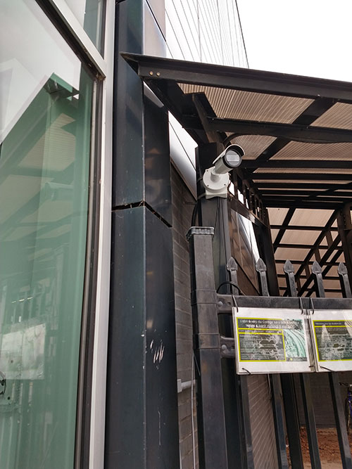

### Expérience vécue
Puisque l'oeuvre se trouve dans un espace public extérieur, le visiteur peut arriver de n'importe quel côté. Le vélo stationnaire ainsi que la musique d'ambiance sont ce qui attire d'abord l'attention. Quand le visiteur prend place sur le vélo et pédale, la musique et les lumières changent, incitant l'utilisateur à continuer son mouvement afin d'assister aux prochains changements. 

### Ce qui m'a plu
J'ai beaucoup apprécié l'interactivité du projet, de même que sa signification par rapport à notre impact sur la nature et sa volonté de sensibiliser sur la crise climatique. Cette cause en est une qui me tient particulièrement à coeur, et je pense que LumaSol était le projet dont le message était le plus clairement cité au préalable. 

### Ce que je ferais autrement
Malgré une intention bien établie dans la documentation en ligne, le message aurait pu être véhiculé de façon plus évidente. En effet, sans la précision des créateurs, il aurait été difficile de faire le lien entre les changements de couleurs et le rythme des saisons. Une fiche explicative près du vélo aurait pu mettre le tout en évidence. En outre, je trouve que c'était un peu trop subtil, on aurait pu prendre l'utilisateur par surprise un peu plus.

### Références
https://tim-montmorency.com/2023/

https://tim-montmorency.com/2023/projets/LumaSol/docs/web/preproduction.html
