# Mycélium 
Voici de quelle façon les finissants en TIM décrivent leur projet: "Réseau de filaments essentiel à la vie d’un champignon, Mycélium est l’un des mots-clés de notre existence. Cette connexion immuable entre l’être humain et son écosystème, ainsi que ce désir inné de comprendre et d’être compris sont au cœur même de nos inspirations. Comment interagissons-nous avec notre environnement? Comment interagissons-nous avec la technologie? Comment interagissons-nous avec nous-mêmes? Ce réseau de filaments indescriptible est aussi ce qui nous rassemble à un seul et même endroit." ([Site TIM 2023](https://tim-montmorency.com/2023/))

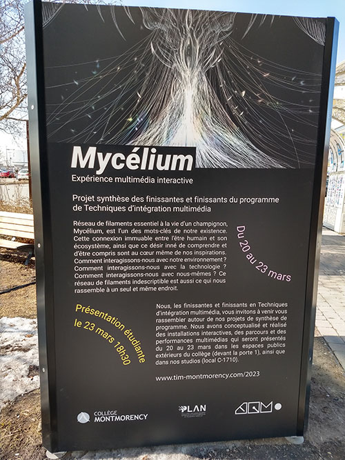 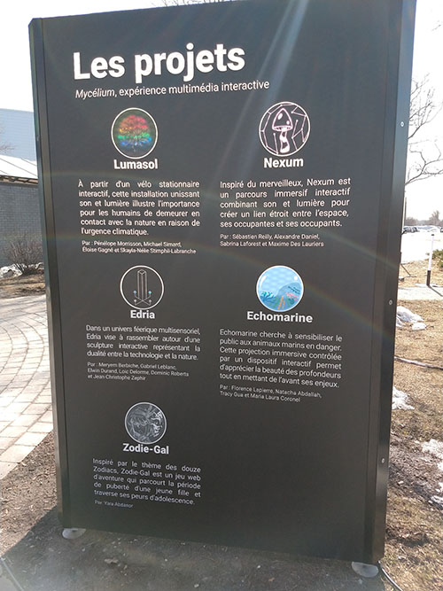 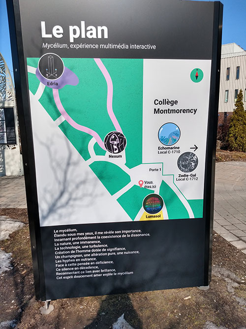

## Echomarine 
### Créatrices
- [Florence Lapierre](https://tim-montmorency.com/2023/projets/Echomarine/docs/web/journal_1.html)
- [Natacha Abdallah](https://tim-montmorency.com/2023/projets/Echomarine/docs/web/journal_2.html)
- [Tracy Gua](https://tim-montmorency.com/2023/projets/Echomarine/docs/web/journal_3.html)
- [Maria Laura Coronel](https://tim-montmorency.com/2023/projets/Echomarine/docs/web/journal_4.html)

### Lien avec le thème Mycélium 
Comme le projet a pour objectif de sensibiliser les participants aux enjeux de la vie sous-marine, le lien pourrait se trouver dans la connexion des humains avec un écosystème et la façon dont ils interagissent avec l'environnement. 

### Installation en cours
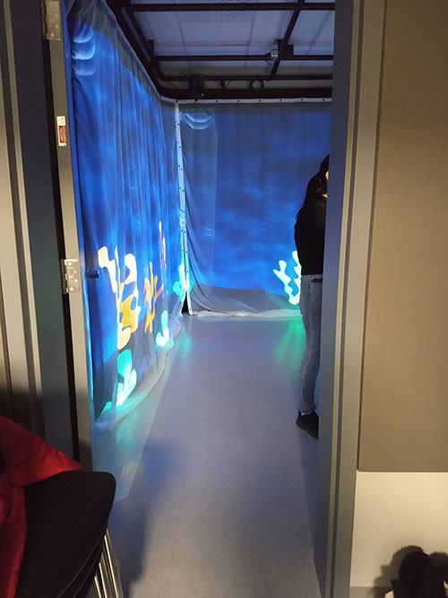  

### Schéma de l'installation prévue

## EDRIA
### Créateurs et créatrice 
- [Elwin Durand](https://tim-montmorency.com/2023/projets/EDRIA/docs/web/journal_1.html)
- [Loic Delorme](https://tim-montmorency.com/2023/projets/EDRIA/docs/web/journal_2.html)
- [Dominic Roberts](https://tim-montmorency.com/2023/projets/EDRIA/docs/web/journal_3.html)
- [Gabriel Leblanc](https://tim-montmorency.com/2023/projets/EDRIA/docs/web/journal_4.html)
- [Meryem Berbiche](https://tim-montmorency.com/2023/projets/EDRIA/docs/web/journal_5.html)
- [Jean-Christophe Zephir](https://tim-montmorency.com/2023/projets/EDRIA/docs/web/journal_6.html)

### Lien avec le thème Mycélium 
Le lien avec le thème est clairement énoncé dans l'intention de départ du projet: "rassembler autour d'une sculpture représentant la dualité entre la technologie et la nature." ([Edria](https://tim-montmorency.com/2023/projets/EDRIA/docs/web/preproduction.html#intention-de-d%C3%A9part))

### Installation en cours
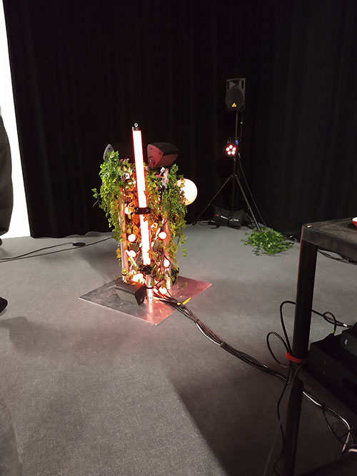 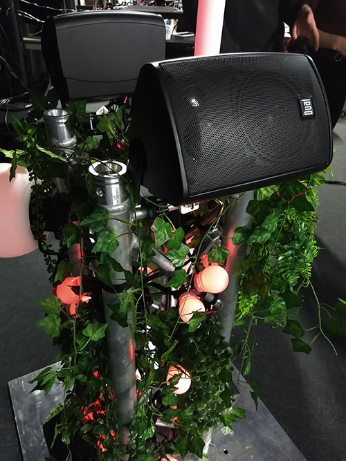  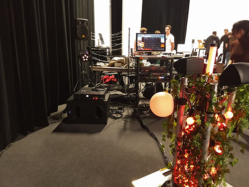

### Schéma de l'installation prévue

## LumaSol 
### Créateur et créatrices 
- [Éloïse Gagné](https://tim-montmorency.com/2023/projets/LumaSol/docs/web/journal_1.html)
- [Skayla Stimphil](https://tim-montmorency.com/2023/projets/LumaSol/docs/web/journal_2.html)
- [Michaël Simard](https://tim-montmorency.com/2023/projets/LumaSol/docs/web/journal_3.html)
- [Pénélope Morrisson](https://tim-montmorency.com/2023/projets/LumaSol/docs/web/journal_4.html)

### Lien avec le thème Mycélium 
Ce projet utilise l'interaction de l'utilisateur pour illustrer l'impact de l'action humaine sur l'environnement. 

### Installation en cours
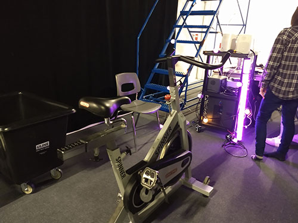 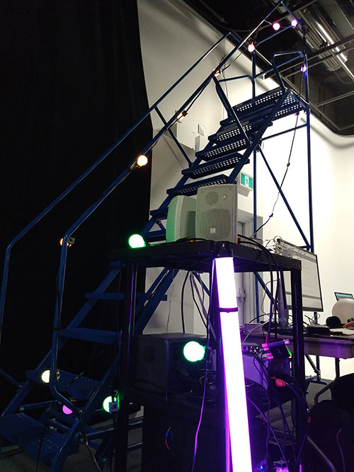 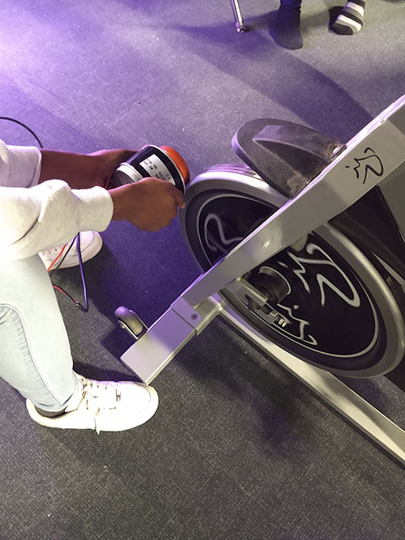

### Schéma de l'installation prévue

## Nexum
### Créateurs et créatrice 
- [Sébastien Reilly](https://tim-montmorency.com/2023/projets/Boucler-la-boucle/docs/web/journal_1.html)
- [Sabrina Laforest](https://tim-montmorency.com/2023/projets/Boucler-la-boucle/docs/web/journal_2.html)
- [Alexandre Daniel](https://tim-montmorency.com/2023/projets/Boucler-la-boucle/docs/web/journal_3.html)
- [Maxime Des Lauriers](https://tim-montmorency.com/2023/projets/Boucler-la-boucle/docs/web/journal_4.html)

### Lien avec le thème Mycélium
Ce parcours interactif permet la connexion entre l'humain et son espace en réagissant au passage des participants de plusieurs façons différentes.

### Installation en cours
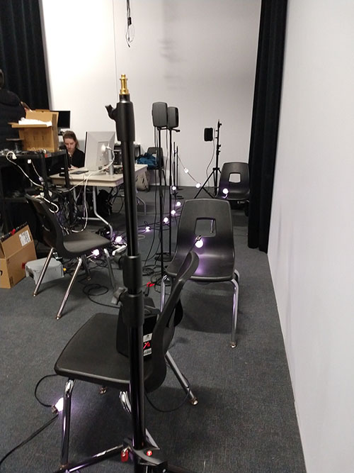 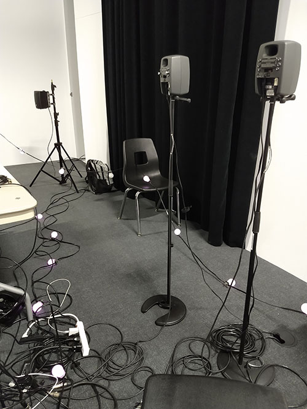 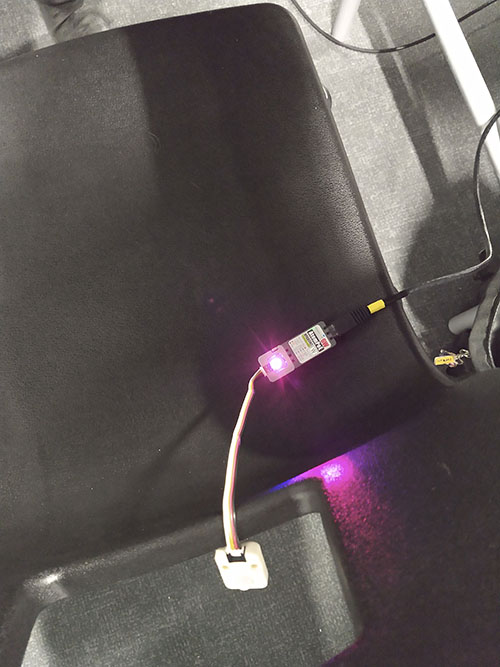

### Schéma de l'installation prévue

## Zodie-Gal 
### Créatrice
- [Abdanor Yara](https://tim-montmorency.com/2023/projets/Zodie-Gal/docs/web/journal_1.html)

### Lien avec le thème Mycélium
Zodie-Gal fait le lien avec le thème Mycélium en faisant une analogie entre une jeune fille en crise d'adolescence et la nature qui doit composer avec le monde urbain. Tous deux sont des éléments vivants en évolution dans un contexte difficile, qui doivent trouver comment survivre.

### Installation en cours
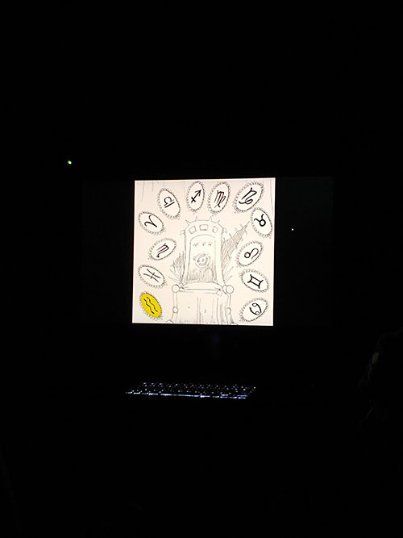 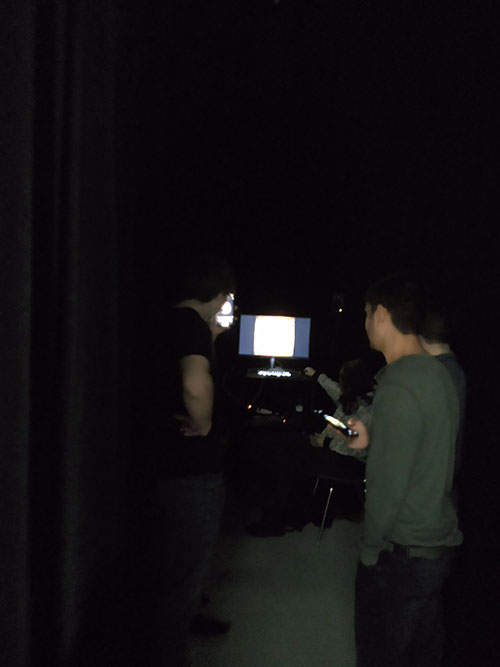

### Schéma de l'installation prévue

## Cours incontournables
Dans la grille de cours que je suis actuellement (par opposition à la nouvelle grille mise en place pour la prochaine cohorte), je crois que les trois cours les plus utiles pour mettre sur pieds ce genre de projet sont Conception sonore interactive, Conception de projet multimédia et Espace interactif.

## Composante technologique
Parmi les composantes électroniques utilisées pour le projet LumaSol se trouve un relais. "Un relais permet de contrôler l'ouverture et la fermeture d'un circuit électrique grâce à un signal électrique provenant d'un autre circuit. L'avantage apporté par l'emploi d'un relais est qu'il permet d'isoler le circuit de commande et celui commandé. Aucun contact électrique n'existe donc entre les deux circuits, ce qui permet de coupler un circuit à haute tension avec un circuit à basse tension." [AlloProf](https://www.alloprof.qc.ca/fr/eleves/bv/sciences/les-autres-fonctions-electriques-s1558)
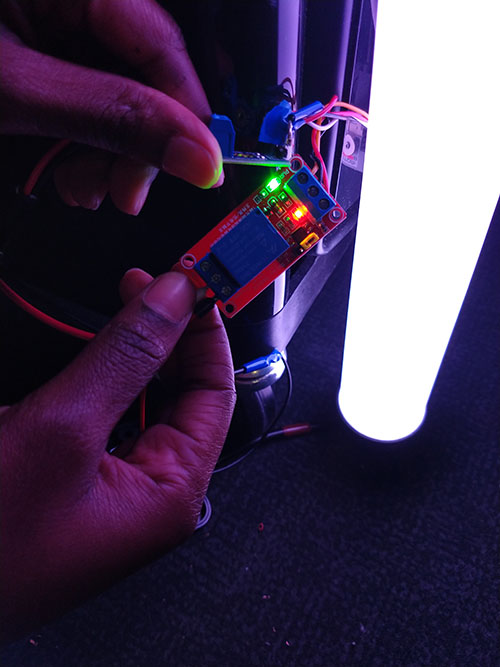

## Ordre de préférence des projets
1. Edria: Leur logo est celui que je préfère et l'idée est originale. 
2. LumaSol: Je trouve intéressant l'association de plusieurs concepts: l'exercice physique, l'interaction humaine par le mouvement qui a un impact sur l'environnement et qui permet également la recharge du téléphone, les couleurs des lumières qui représentent le cycle des saisons.
3. Nexum: Vraiment un beau projet mais l'installation préliminaire dans le studio ne permettait pas de bien imaginer de quoi ça aurait l'air en réalité.
4. Echomarine: Le plus immersif des projets selon moi, mais je trouve le lien avec le thème un peu moins évident et les illustrations gagneraient à être plus détaillées.
5. Zodie-Gal: J'ai trouvé que ce projet était le plus difficile à associer au thème général. D'un point de vue personnel, je n'aime pas vraiment le style graphique des dessins. Le style est uniforme mais je trouve difficile de bien identifier les éléments représentés. Je trouvais également le récit plus ou moins clair. Par contre, malgré le manque de clarté général, la créatrice expliquait bien ses concepts.

## Ressenti anticipé
**Edria**: Avec le poteau central plus haut, j'imagine que ce sera encore plus amusant de tester les différentes interactions et leurs combinaisons. 
**LumaSol**: C'est un projet qui fait activement participer l'utilisateur et je pense que j'apprécierai voir mon action donner un résultat concret et féérique à la fois.
**Nexum**:
**Echomarine**: L'installation semblait presque complétée, alors je pense que le ressenti ne changera pas beaucoup lors de la présentation officielle. C'est une ambiance calme, ludique, sereine et enveloppante.
**Zodie-Gal**:
