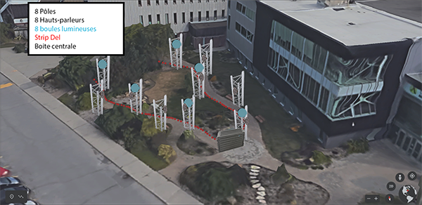

# Mycélium 

## Echomarine 
### Créatrices
- [Florence Lapierre](https://tim-montmorency.com/2023/projets/Echomarine/docs/web/journal_1.html)
- [Natacha Abdallah](https://tim-montmorency.com/2023/projets/Echomarine/docs/web/journal_2.html)
- [Tracy Gua](https://tim-montmorency.com/2023/projets/Echomarine/docs/web/journal_3.html)
- [Maria Laura Coronel](https://tim-montmorency.com/2023/projets/Echomarine/docs/web/journal_4.html)

### Lien avec le thème Mycélium 

### Installation en cours

### Schéma de l'installation prévue

## EDRIA
### Créateurs et créatrice 
- [Elwin Durand](https://tim-montmorency.com/2023/projets/EDRIA/docs/web/journal_1.html)
- [Loic Delorme](https://tim-montmorency.com/2023/projets/EDRIA/docs/web/journal_2.html)
- [Dominic Roberts](https://tim-montmorency.com/2023/projets/EDRIA/docs/web/journal_3.html)
- [Gabriel Leblanc](https://tim-montmorency.com/2023/projets/EDRIA/docs/web/journal_4.html)
- [Meryem Berbiche](https://tim-montmorency.com/2023/projets/EDRIA/docs/web/journal_5.html)
- [Jean-Christophe Zephir](https://tim-montmorency.com/2023/projets/EDRIA/docs/web/journal_6.html)

### Lien avec le thème Mycélium 

### Installation en cours

### Schéma de l'installation prévue

## LumaSol 
### Créateur et créatrices 
- [Éloïse Gagné](https://tim-montmorency.com/2023/projets/LumaSol/docs/web/journal_1.html)
- [Skayla Stimphil](https://tim-montmorency.com/2023/projets/LumaSol/docs/web/journal_2.html)
- [Michaël Simard](https://tim-montmorency.com/2023/projets/LumaSol/docs/web/journal_3.html)
- [Pénélope Morrisson](https://tim-montmorency.com/2023/projets/LumaSol/docs/web/journal_4.html)

### Lien avec le thème Mycélium 

### Installation en cours

### Schéma de l'installation prévue

## Nexum
### Créateurs et créatrice 
- [Sébastien Reilly](https://tim-montmorency.com/2023/projets/Boucler-la-boucle/docs/web/journal_1.html)
- [Sabrina Laforest](https://tim-montmorency.com/2023/projets/Boucler-la-boucle/docs/web/journal_2.html)
- [Alexandre Daniel](https://tim-montmorency.com/2023/projets/Boucler-la-boucle/docs/web/journal_3.html)
- [Maxime Des Lauriers](https://tim-montmorency.com/2023/projets/Boucler-la-boucle/docs/web/journal_4.html)

### Lien avec le thème Mycélium

### Installation en cours

### Schéma de l'installation prévue

## Zodie-Gal 
### Créatrice
- [Abdanor Yara](https://tim-montmorency.com/2023/projets/Zodie-Gal/docs/web/journal_1.html)

### Lien avec le thème Mycélium
Zodie-Gal fait le lien avec le thème Mycélium en faisant une analogie entre une jeune fille en crise d'adolescence et la nature qui doit composer avec le monde urbain. Tous deux sont des éléments vivants en évolution dans un contexte difficile, qui doivent trouver comment survivre.

### Installation en cours

### Schéma de l'installation prévue

## Cours incontournables

## Composante technologique

## Ordre de préférence des projets

## Ressenti anticipé

