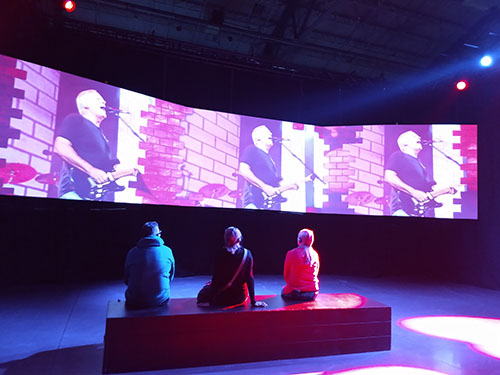

# Pink Floyd l'Exposition: Their Mortal Remains

[Bande annonce](https://www.youtube.com/watch?v=mZ9olu3ex7U&ab_channel=PinkFloydExhibition%3ATheirMortalRemains)

### Lieu de mise en exposition
À Montréal, l'exposition avait lieu à la galerie Arnesal Art Contemporain du 4 novembre 2022 au 2 avril 2023, après trois prolongations. Je l'ai visitée le 9 février 2023.

### Type d'exposition
Their Mortal Remains est une exposition temporaire itinérante produite par S2BN qui fait le tour du monde depuis 2017. Elle est le fruit d'une collaboration entre les membres de Pink Floyd et le commissaire et directeur créatif Aubrey Powell. 

<< Pink Floyd l'Exposition: Their Mortal Remains est une expérience interactive et immersive qui donne aux visiteurs un aperçu dans les coulisses de l’histoire du groupe de renommée mondiale. Un parcours audiovisuel à travers cinq décennies de l’un des groupes les plus iconiques de son temps, et un rare coup d’œil sur leur carrière et leurs vies personnelles. >> ([Pink Floyd l'Exposition](https://pinkfloydexhibition.com/fr/a-propos/))

 

  

# Film Comfortably Numb

### Description de l'oeuvre
Comme dernière installation de l'exposition, une vidéo d'une dizaine de minutes était présentée sur un grand écran triple. Il s'agit d'un montage repensé d'une performance de la chanson *Comfortably Numb* filmée lors de la dernière représentation donnée par Pink Floyd en tant que groupe, au Live 8 en 2005 ([Tourisme Montréal](https://www.mtl.org/en/experience/pink-floyd-exhibition-montreal)). Parfois l'image était triple, parfois elle prenait toute la largeur des écrans. 

 

### Type d'installation
Il s'agit d'une installation contemplative.

### Fonction du dispositif

### Mise en espace
### Composantes et techniques
### Éléments nécessaires à la mise en exposition
### Expérience vécue
### Ce qui m'a plu
J'ai beaucoup aimé le choix de vidéo. Le fait que ce soit la dernière représentation et que les membres du groupe soient plus âgés conservait bien la chronologie du parcours et la cohérence de l'exposition. C'était agréable d'enfin entendre une chanson complète à un volume plus élévé. 

### Ce que je ferais autrement
### Références
https://www.mtl.org/en/experience/pink-floyd-exhibition-montreal

https://pinkfloydexhibition.com/fr/a-propos/
